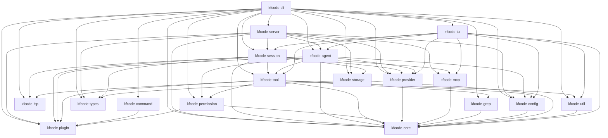
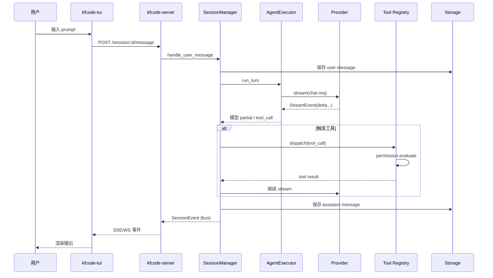

# KFCode 技术栈架构蓝图（Technology Stack Blueprint）

- 项目名称：**KFCode**
- 可执行文件名：`kfcode`
- 仓库根：`/Users/dfbb/Sites/kfcode/3rd/agent/KFCode`
- 文档版本：`2026.02.23`
- 工作区版本：`0.1.0`（Cargo workspace 统一）
- 许可证：MIT
- 文档深度：Comprehensive
- 组织维度：按分层架构（Layer）
- 输出格式：Markdown

> 本文档以源码与构建脚本为唯一事实来源，按"自顶向下 + 跨层穿透"的方式刻画 KFCode 的技术栈、模块边界、数据流、可扩展点与实现规约。

---

## 1. 一句话定位

KFCode 是一个面向"本地 AI 编码 Agent"的 **Rust 工作区项目**。它通过统一的 CLI 入口同时承载：

- 终端交互式 UI（TUI）
- 单次任务执行（`run`）
- 本地 HTTP/SSE/WebSocket 服务（`serve` / `web` / `acp`）
- 会话管理、模型 Provider、工具调用、权限决策、MCP/LSP/Plugin 扩展、文件监听

它的形态是 **Cargo 多 crate workspace**（19 个 crate），每个 crate 承担明确的"分层职责"，最终由 `kfcode-cli` 组装为一个二进制。

---

## 2. 顶层视图

### 2.1 分层视图（Layered View）

```
┌──────────────────────────────────────────────────────────────────────┐
│                  入口层 / Entrypoint Layer                          │
│  kfcode-cli  (clap 派遣 → tui / run / serve / web / acp / ...)     │
└──────────────────────────────────────────────────────────────────────┘
            │                                │
            ▼                                ▼
┌────────────────────────┐      ┌──────────────────────────────────────┐
│   交互层 / UI Layer    │      │  服务层 / Service Layer              │
│  kfcode-tui          │◀────▶│  kfcode-server                     │
│  (ratatui + 自有 app)  │ HTTP │  (axum + SSE + WebSocket)            │
└────────────────────────┘      └──────────────────────────────────────┘
            │                                │
            └────────────────┬───────────────┘
                             ▼
┌──────────────────────────────────────────────────────────────────────┐
│            会话与编排层 / Session & Orchestration Layer             │
│   kfcode-session   ←   kfcode-agent   →   kfcode-command       │
└──────────────────────────────────────────────────────────────────────┘
            │                  │                     │
            ▼                  ▼                     ▼
┌────────────┐  ┌────────────────┐  ┌────────────────────────────────┐
│ 工具层     │  │ Provider 层    │  │  扩展层 / Extension Layer      │
│ kfcode-    │  │ kfcode-        │  │  kfcode-plugin (TS bridge)   │
│ tool       │  │ provider       │  │  kfcode-mcp (MCP 客户端)     │
│            │  │ (Anthropic /   │  │  kfcode-lsp (LSP 客户端)     │
│ + grep,    │  │  OpenAI / ...) │  │  kfcode-watcher (FS Watch)   │
│   permis-  │  │                │  │                                │
│   sion     │  │                │  │                                │
└────────────┘  └────────────────┘  └────────────────────────────────┘
            │                  │                     │
            └────────────────┬─┴─────────────────────┘
                             ▼
┌──────────────────────────────────────────────────────────────────────┐
│            基础设施层 / Foundation Layer                            │
│  kfcode-types  /  kfcode-config  /  kfcode-storage (SQLite)    │
│  kfcode-core (Bus + Id)  /  kfcode-util (fs / log / util)        │
└──────────────────────────────────────────────────────────────────────┘
```

### 2.2 物理形态

- **构建工件**：`./target/{debug,release}/kfcode`
- **运行模式**：
  - 默认：本地 TUI；按需在内嵌进程内启动 `kfcode-server` 提供 API
  - 服务端模式：`serve` / `web` / `acp` 直接以 axum HTTP 服务运行
  - 单次任务：`run`，不进入交互
- **数据持久化**：本地 SQLite（由 `kfcode-storage` 管控）
- **配置发现**：项目级 `kfcode.json(c)`、`.kfcode/kfcode.json(c)`，全局 `~/.config/kfcode/kfcode.jsonc`

---

## 3. 技术识别（Technology Identification）

### 3.1 语言与构建

| 维度 | 选型 | 来源 |
|---|---|---|
| 语言 | Rust（`edition = "2021"`） | `Cargo.toml` workspace |
| 工作区版本 | `0.1.0` | workspace.package |
| 构建系统 | Cargo（`resolver = "2"`） | `Cargo.toml` |
| 锁文件 | `Cargo.lock`（约 12.6 万行依赖图） | repo 根 |
| 工具链 | Rust stable（无 `rust-toolchain`，遵循默认 stable） | README §1 Requirements |

### 3.2 工作区 19 个 crate（按分层归类）

| 分层 | Crate | 关键职责 |
|---|---|---|
| 入口 | `kfcode-cli` | 单一二进制；clap 派遣；组装所有上层模块 |
| 交互 | `kfcode-tui` | 终端 UI（自研事件循环 + 组件树 + 主题/语法高亮） |
| 服务 | `kfcode-server` | axum HTTP / SSE / WebSocket / OAuth / PTY |
| 编排 | `kfcode-session` | 会话状态机、消息流、压缩、摘要、回滚 |
| 编排 | `kfcode-agent` | Agent 注册 + 执行编排（驱动 provider/tool/permission） |
| 编排 | `kfcode-command` | 斜杠命令注册、模板渲染、动态 `.kfcode/commands/*.md` |
| 工具 | `kfcode-tool` | 工具系统、内建工具（read/write/edit/bash/...） |
| 工具 | `kfcode-grep` | ripgrep 包装（搜索抽象） |
| 工具 | `kfcode-permission` | 权限规则 + Allow/Deny/Ask 决策 |
| Provider | `kfcode-provider` | 多厂商模型适配层（Anthropic/OpenAI/Google/...） |
| 扩展 | `kfcode-plugin` | Hook 系统 + TS 子进程桥（JSON-RPC） |
| 扩展 | `kfcode-mcp` | MCP 客户端（HTTP/SSE/Stdio + OAuth） |
| 扩展 | `kfcode-lsp` | LSP 客户端（多语言服务器） |
| 扩展 | `kfcode-watcher` | 文件系统监听（防抖、忽略规则） |
| 基础 | `kfcode-core` | 全局事件 Bus + ID 生成 |
| 基础 | `kfcode-types` | 跨 crate 共享数据结构（消息/会话/Todo） |
| 基础 | `kfcode-config` | 配置发现、JSONC 解析、合并 |
| 基础 | `kfcode-storage` | SQLite + Repository 层 |
| 基础 | `kfcode-util` | 文件系统、日志、通用工具 |

### 3.3 关键依赖（带版本）

| 类别 | 依赖 | 版本 | 用途 |
|---|---|---|---|
| 异步运行时 | `tokio` | `1`（features = full） | 全局异步运行时 |
| 序列化 | `serde` / `serde_json` | `1` | JSON / 内部数据交换 |
| 错误处理 | `anyhow` / `thiserror` | `1` / `2` | 应用错误 / 库错误 |
| 日志 | `tracing` / `tracing-subscriber` / `tracing-appender` | `0.1` / `0.3` / `0.2` | 结构化日志、文件滚动 |
| 命令行 | `clap` | `4`（derive） | CLI 派遣 |
| HTTP 服务 | `axum` / `axum-extra` | `0.8` / `0.10` | 服务端框架 |
| HTTP 工具链 | `tower` / `tower-http` / `hyper` / `http-body-util` | `0.5` / `0.6` / `1` / `0.1` | 中间件、CORS、追踪、底层 HTTP |
| HTTP 客户端 | `reqwest` / `reqwest-eventsource` | `0.12` / `0.6` | Provider/MCP/Web 拉取 |
| 流处理 | `tokio-stream` / `tokio-util` / `pin-project-lite` / `futures` | `0.1` / `0.7` / `0.2` / `0.3` | 流式响应 / 通用 future |
| DB | `sqlx` | `0.8`（runtime-tokio + sqlite） | SQLite 驱动 |
| 文件监听 | `notify` | `7` | 跨平台 FS watch |
| 终端 | `portable-pty` | `0.8` | TUI/服务端 PTY 桥 |
| 模糊匹配 | `nucleo-matcher` | `=0.3.1` | `@path` 补全等 |
| 语法高亮 | `syntect` | `=5.3.0` | TUI 代码块渲染 |
| Diff | `similar` | `=2.7.0` | 编辑工具/补丁/可视化 |
| 文件遍历 | `walkdir` / `glob` / `regex` | `2` / `0.3` / `1` | 通用文本/路径处理 |
| 解析 | `tree-sitter` / `tree-sitter-bash` | `0.24` / `0.23` | bash 工具/补丁解析 |
| 加密/编码 | `sha2` / `base64` / `hex` | `0.10` / `0.22` / `0.4` | OAuth / 哈希 |
| OAuth | `oauth2` | `5` | 模型 Provider / MCP 鉴权 |
| LSP | `lsp-types` | `0.97` | 协议数据结构 |
| 子进程 | `async-process` / `which` | `2` / `7` | 插件子进程 / 工具发现 |
| 并发 | `parking_lot` / `dashmap` / `once_cell` / `lazy_static` | `0.12` / `6.1` / `1` / `1.4` | 高性能锁 / 并发容器 |
| 杂项 | `uuid` / `chrono` / `dirs` / `url` / `rand` / `content_inspector` | `1` / `0.4` / `6` / `2.5` / `0.8` / `0.2` | ID / 时间 / 路径 / URL / 随机 / 二进制嗅探 |

> 全部统一在 `[workspace.dependencies]` 中（见 `Cargo.toml` 31–82 行），各子 crate 通过 `workspace = true` 引用，确保版本一致性。

---

## 4. 各分层深度展开

### 4.1 入口层：`kfcode-cli`

- **入口源文件**：`crates/kfcode-cli/src/main.rs`（约 5550 行）
- **依赖图**（直接依赖 16 个内部 crate）：

```
kfcode-cli
├── kfcode-core       kfcode-util       kfcode-config
├── kfcode-grep       kfcode-permission kfcode-server
├── kfcode-agent      kfcode-provider   kfcode-plugin
├── kfcode-session    kfcode-storage    kfcode-tool
├── kfcode-tui        kfcode-types      kfcode-command
└── kfcode-lsp
```

> 这意味着 CLI crate 是"组装器（assembler）"——它把所有能力 wire 到一起，本身不应承担业务逻辑（业务都下沉到对应 crate 中）。

#### 顶层子命令（与 `--help` 同步）

`tui` / `attach` / `run` / `serve` / `web` / `acp` / `models` / `session` / `stats` / `db` / `config` / `auth` / `agent` / `debug` / `mcp` / `export` / `import` / `github` / `pr` / `upgrade` / `uninstall` / `generate` / `version`

#### 关键实现要点

- 使用 `clap` derive 风格定义（`#[derive(Parser, Subcommand, ValueEnum)]`）。
- `tui` 子命令支持：`-m/--model`、`-c/--continue`、`-s/--session`、`--fork`、`--agent`（默认 `build`）、`--port`、`--hostname`、`--mdns` 等。
- `run` 输出格式：`default | json`，支持 `-f/--file`、`--thinking`、`--variant`。
- `serve` 复用 `kfcode-server::run_server*`。

#### 实现模板（CLI 派遣骨架）

```rust
let cli = Cli::parse();
match cli.command {
    Some(Commands::Tui { model, continue_last, session, .. }) => {
        // 1) 加载配置（kfcode-config）
        // 2) 准备 ProviderRegistry / AgentRegistry / CommandRegistry
        // 3) 必要时启动内嵌 kfcode-server
        // 4) 移交给 kfcode-tui 主循环
    }
    Some(Commands::Run { message, format, .. }) => { /* 单次任务 */ }
    Some(Commands::Serve { port, hostname, .. }) => { /* kfcode-server::run_server */ }
    // ...
}
```

---

### 4.2 交互层：`kfcode-tui`

- **入口**：`crates/kfcode-tui/src/lib.rs`
- **品牌常量（`branding.rs`）**：
  - `APP_NAME = "KFCode"`、`APP_SHORT_NAME = "KFCode"`
  - `APP_VERSION_DATE = "2026.02.23"`、`APP_TAGLINE = "A Rusted KFCode Version"`
- **依赖**：`kfcode-core`、`kfcode-util`、`kfcode-config`、`kfcode-provider`、`kfcode-session`、`kfcode-agent`、`kfcode-tool`、`kfcode-mcp`

#### 模块树

```
src/
├── lib.rs              # 入口
├── api.rs              # 调用本地 kfcode-server 的客户端
├── app/                # 主事件循环 / 状态同步 (app.rs, state.rs, terminal.rs)
├── branding.rs         # 品牌/版本常量
├── command.rs          # 内部命令调度
├── components/         # UI 组件
│   ├── home.rs / session.rs / sidebar.rs / prompt.rs
│   ├── dialog.rs / dialogs/ / message.rs / message_palette.rs
│   ├── permission.rs / question.rs / spinner.rs / thinking.rs
│   ├── tool_call.rs / tool_views.rs / todo_item.rs
│   ├── markdown/                      # 代码块 + syntect 高亮
│   ├── revert_card.rs / toast.rs / slash_command.rs
│   ├── session_message.rs / session_text.rs / session_tool.rs
│   ├── semantic_highlight.rs / diff.rs / logo.rs
├── context/            # 应用状态 / 键位 / 缓存
├── event.rs            # 事件枚举
├── file_index.rs       # @path 补全索引（nucleo-matcher）
├── hooks/              # 跨组件订阅
├── router.rs           # UI 路由
├── terminal.rs         # 终端原语
├── theme/              # 主题（含 presets/）
└── ui/                 # 通用绘制原语
    ├── border.rs / clipboard.rs / layout.rs
    ├── selection.rs / text.rs
```

#### 关键能力

- 折叠侧边栏（含 `☰` 显式开关）
- 可切换的 Braille / KnightRider 风格 spinner
- 消息块布局优化、状态行
- syntect 代码高亮 + `@path` 路径感知补全
- 鼠标 hover + 滚动支持

#### 渲染规约（约束）

- UI 改动需保证滚动稳定性、低 CPU 占用
- 鼠标处理需测试 hover + 滚动
- 文本必须按 UTF-8 字符边界切片，避免 panic

---

### 4.3 服务层：`kfcode-server`

- **依赖**：`kfcode-core`、`kfcode-agent`、`kfcode-provider`、`kfcode-session`、`kfcode-storage`、`kfcode-types`、`kfcode-config`、`kfcode-mcp`、`kfcode-plugin`
- **基础栈**：axum 0.8 + tower / tower-http（CORS、文件、tracing）+ hyper 1

#### 模块结构

```
src/
├── lib.rs              # 入口
├── server.rs           # ServerState / run_server* / CORS / 启动生命周期
├── routes.rs           # 全部路由定义（约 4720 行）
├── oauth.rs            # 模型 Provider OAuth
├── mcp_oauth.rs        # MCP OAuth
├── pty.rs              # PTY/终端桥（portable-pty）
├── worktree.rs         # 工作区操作
└── error.rs            # 错误模型
```

#### 路由分组（按业务域）

| 分组 | 前缀 | 用途 |
|---|---|---|
| 基础 | `/health`、`/event`、`/path`、`/vcs` | 健康检查、事件流、路径/VCS |
| 会话 | `/session/*` | 创建、消息、压缩、摘要、回滚 |
| Provider | `/provider/*` | 模型/配额/鉴权状态 |
| 配置 | `/config/*` | 读取/合并/调试 |
| MCP | `/mcp/*` | 注册/连接/工具同步 |
| 文件 | `/file/*` | 读写/差异/上传 |
| 搜索 | `/find/*` | grep / glob / codesearch |
| 权限 | `/permission/*` | 询问/允许/拒绝 |
| 项目 | `/project/*` | 工作区元信息 |
| PTY | `/pty/*` | 远端终端会话 |
| TUI 控制 | `/tui/*` | TUI ↔ Server 双向控制 |
| 实验 | `/experimental/*` | 试用功能 |
| 插件鉴权 | `/plugin/*` | TS 插件 OAuth bridge |

#### 关键类型

- `ServerState`（路由共享上下文，组装 SessionManager / Provider / MCP / Plugin / Storage）
- `pub async fn run_server(addr)` / `pub async fn run_server_with_state(...)`
- CORS 白名单：`set_cors_whitelist(origins)` + `is_allowed_origin` + `is_extra_allowed_origin`

#### 接入规约

- 新增路由前先定义 input/output 模型（在 `kfcode-types` 或本 crate 内）
- 高并发路径避免阻塞（使用 `tokio::spawn` / 流）
- API 变更需同步 CLI/TUI 调用点

---

### 4.4 编排层

#### 4.4.1 `kfcode-session`（约 1540 行的 `session.rs` + 1860 行的 `llm.rs`）

- **依赖**：`kfcode-core`、`kfcode-types`、`kfcode-storage`、`kfcode-provider`、`kfcode-tool`、`kfcode-mcp`、`kfcode-lsp`、`kfcode-plugin`

```
src/
├── lib.rs
├── session.rs          # Session、SessionManager、SessionEvent、SessionStatus
├── llm.rs              # 模型请求/响应组装（流、function-calling、retry）
├── message.rs / message_v2.rs   # 消息结构 v1/v2
├── prompt.rs / prompt_templates/ # 提示词构造
├── instruction.rs      # 指令注入
├── system.rs           # SystemPrompt + EnvironmentContext
├── compaction.rs       # 上下文压缩（长会话）
├── summary.rs          # 摘要
├── revert.rs / snapshot.rs   # 回滚 / 快照
├── status.rs / todo.rs       # 状态 / 待办
└── retry.rs            # 会话级重试
```

##### 关键导出

```text
Session, SessionManager, SessionEvent, SessionStatus, SessionSummary,
SessionStateManager, SessionStateEvent, SessionUsage, SessionShare,
SessionRevert, FileDiff, BusyError
```

##### 关键约束

- 消息顺序变更必须覆盖**流式**与**中断**两条路径
- 插件 hook 输入/输出字段须保持稳定（避免破坏 TS 桥）
- 回滚（revert）与摘要逻辑要优先保证可恢复性

#### 4.4.2 `kfcode-agent`

- **依赖**：`kfcode-core`、`kfcode-provider`、`kfcode-permission`、`kfcode-tool`、`kfcode-config`、`kfcode-plugin`
- **模块**：
  - `agent.rs`：`AgentInfo` / 注册表 `AgentRegistry`
  - `executor.rs`：`AgentExecutor` 编排（provider × tool × permission）
  - `message.rs`：Agent 视角的消息结构与转换
- **职责边界**：Agent 关心"如何用模型 + 工具完成一个 turn"，Session 关心"会话整体生命周期"。

#### 4.4.3 `kfcode-command`

- **依赖**：`kfcode-plugin`
- **核心类型**：`Command` / `CommandSource` / `CommandContext` / `CommandRegistry`
- **内建命令**：`init`、`review`、`commit`、`test`
- **动态加载源**：`.kfcode/commands/*.md`、MCP 命令、Skill 命令
- **典型触发点**：CLI/TUI 的斜杠命令、Server 的命令端点、`command.execute.before` hook

---

### 4.5 工具层

#### 4.5.1 `kfcode-tool`

- **依赖**：`kfcode-core`、`kfcode-config`、`kfcode-util`、`kfcode-grep`、`kfcode-plugin`、`kfcode-permission`、`kfcode-lsp`（`lsp` feature）

##### 内建工具一览

| 类别 | 工具文件 |
|---|---|
| 文件 | `read.rs`、`write.rs`、`edit/`、`multiedit.rs`、`ls.rs` |
| 搜索 | `grep_tool.rs`、`glob_tool.rs`、`codesearch.rs` |
| 执行 | `bash.rs`（含 tree-sitter-bash 解析）、`batch.rs`、`apply_patch.rs` |
| 任务 | `plan.rs`、`task.rs`、`todo.rs`、`question.rs` |
| 网络 | `webfetch.rs`、`websearch.rs` |
| LSP | `lsp_tool.rs`（`lsp` feature） |
| 其他 | `external_directory.rs`、`skill.rs`、`invalid.rs`、`truncation.rs`、`registry.rs`、`tool.rs` |

##### Feature 开关

- `lsp`：启用 `kfcode-lsp` 与 `lsp-types`，对应 `lsp_tool` 启用

##### 工具实现模板（约束）

```rust
pub struct MyTool;

impl Tool for MyTool {
    fn name(&self) -> &str { "my_tool" }
    fn schema(&self) -> ToolSchema { /* JSON Schema */ }
    async fn execute(&self, ctx: &ToolContext, input: Value) -> ToolResult {
        // 1) 通过 kfcode-permission 进行前置许可（副作用类工具必须）
        // 2) 触发 ToolExecuteBefore hook，允许插件改写
        // 3) 真正执行（保持幂等优先；为可观测性输出 tracing 日志）
        // 4) 触发 ToolExecuteAfter hook
        // 5) 通过 truncation 做 TUI 友好截断后返回
    }
}
```

#### 4.5.2 `kfcode-grep`

- **依赖**：`kfcode-core`
- **关键类型**：`Ripgrep`、`FileSearchOptions`、`MatchResult`、`SubMatch`、`Stats`
- **要点**：大目录扫描提前应用 ignore 过滤；结果同时服务 TUI 与 JSON

#### 4.5.3 `kfcode-permission`

- **依赖**：`kfcode-core`、`kfcode-plugin`
- **模块**：`ruleset.rs`（规则结构 + 匹配 + 解析）、`arity.rs`（粒度/参数分类）、`engine.rs`（决策）
- **决策结果**：Allow / Deny / **Ask**（与 `PermissionAsk` hook 配合，TUI/Server 弹窗）
- **可解释性**：每次决策必须能给出"匹配规则、动作、目标"三元组

---

### 4.6 Provider 层：`kfcode-provider`

- **依赖**：`kfcode-core`
- **覆盖厂商**（每家一个文件）：
  - Anthropic、OpenAI、Google（Gemini）、xAI、Groq、Cohere、Mistral、DeepSeek、DeepInfra、Cerebras、Together、Perplexity、OpenRouter、GitHub Copilot、GitLab、Vercel、Vertex、Bedrock、Azure
- **核心抽象**：
  - `provider.rs`：`Provider` trait，统一调用入口
  - `bootstrap.rs`：从配置/环境构建 `ProviderRegistry`
  - `models.rs`：模型元数据 + 上下文窗口（`get_model_context_limit`）
  - `stream.rs`：`StreamEvent` 流式事件抽象
  - `retry.rs`：`with_retry` / `with_retry_and_hook`，可重试性策略
  - `convert.rs` / `responses.rs` / `responses_convert.rs` / `transform.rs` / `tools.rs` / `message.rs`：协议转换、工具调用、消息映射
  - `auth.rs` / `custom_fetch.rs`：鉴权与自定义 HTTP

#### 关键导出

```text
create_registry_from_bootstrap_config, create_registry_from_env,
with_retry, with_retry_and_hook, get_model_context_limit,
ProviderRegistry, StreamEvent, AuthInfo,
ConfigModel, ConfigProvider
```

#### 与外部模块关系

- 上游消费者：`kfcode-session`、`kfcode-agent`、`kfcode-cli`
- 与 `kfcode-plugin` 集成：`ChatHeaders` / `ChatMessagesTransform` 等 hook 可在请求前改写参数

---

### 4.7 扩展层

#### 4.7.1 `kfcode-plugin`（无内部依赖；可被任何上层依赖）

- **核心类型**：`HookEvent`、`HookContext`、`HookOutput`、`Hook`、`PluginSystem`、`PluginRegistry`
- **关键事件**：
  - 工具：`ToolExecuteBefore` / `ToolExecuteAfter` / `ToolDefinition`
  - 聊天：`ChatSystemTransform` / `ChatMessagesTransform` / `ChatHeaders`
  - 命令：`CommandExecuteBefore`
  - 权限：`PermissionAsk`
  - 会话：`SessionCompacting`
- **TS 子进程桥**：`src/subprocess/` 负责发现、生命周期、JSON-RPC 转发、auth 桥
- **使用模板**：

```rust
let outputs = plugin_system.trigger_collect(HookEvent::ChatHeaders, ctx).await?;
for out in outputs {
    apply_headers(&mut req, out);
}
```

#### 4.7.2 `kfcode-mcp`

- **依赖**：`kfcode-core`
- **模块**：
  - `client.rs`：`McpClient` / `McpClientRegistry`
  - `tool.rs`：`McpToolRegistry`，把 MCP 工具桥接为 `kfcode-tool` 工具
  - `oauth.rs` / `auth.rs`：`McpOAuthManager` / `OAuthRegistry`
  - `transport.rs`：HTTP / SSE / Stdio 传输抽象
  - `protocol.rs`：JSON-RPC
- **事件**：`MCP_TOOLS_CHANGED_EVENT`（工具列表变化时触发）
- **接入点**：CLI（`kfcode mcp ...`）、Server（`/mcp/*`）、Session 动态扩展工具集

#### 4.7.3 `kfcode-lsp`（无内部依赖）

- **关键类型**：`LspClient`、`LspClientRegistry`、`LspServerConfig`、`LspEvent`、`JsonRpcRequest/Response/Notification`、`LspError`
- **接入点**：`kfcode-tool` 的 `lsp_tool`（feature gated）、TUI/Server LSP 状态调试

#### 4.7.4 `kfcode-watcher`（无内部依赖）

- **关键类型**：`FileWatcher`、`WatcherConfig`、`WatcherEvent`、`FileEvent`、`WatcherError`
- **默认行为**：递归；忽略 `.git`、`node_modules`、`target`、临时文件；100 ms 防抖
- **接入点**：会话内文件变更、上下文刷新、侧边栏与诊断更新

---

### 4.8 基础设施层

#### 4.8.1 `kfcode-core`（顶端无依赖）

- **`bus.rs`**：异步事件总线，提供 `BusEvent`、`BusEventDef`、`Bus` 与 `define_event(&'static str)`
- **`id.rs`**：`Prefix` 枚举、`create(prefix, descending, timestamp)` 生成、`timestamp(id)` 解析、`validate_prefix`
- **职责红线**：不放业务逻辑；任何变更需考虑 workspace 级影响

#### 4.8.2 `kfcode-types`（无依赖）

- 模块：`message.rs`（消息体/分片）、`session.rs`（会话/元数据）、`todo.rs`（待办）
- 红线：保持 JSON 字段语义稳定；外部结构变更优先选择向后兼容方案
- 消费者：`kfcode-session`（业务流转）、`kfcode-storage`（持久化边界）、`kfcode-server`（API 层）

#### 4.8.3 `kfcode-config`

- **依赖**：`kfcode-core`
- 模块：`loader.rs`、`schema.rs`、`wellknown.rs`
- 配置发现优先级（向上搜索）：
  1. `kfcode.jsonc` / `kfcode.json`（项目根）
  2. `.kfcode/kfcode.jsonc` / `.kfcode/kfcode.json`
  3. `~/.config/kfcode/kfcode.jsonc`（或 `.json`）
- 解析：JSONC（注释友好）→ 强类型结构；新增字段必须有默认行为

#### 4.8.4 `kfcode-storage`

- **依赖**：`kfcode-core`、`kfcode-types`、`sqlx`（runtime-tokio + sqlite）
- 模块：`database.rs`（连接 + 迁移）、`schema.rs`、`repository.rs`
- 关键导出：`Database`、`DatabaseError`、`SessionRepository`、`MessageRepository`、`TodoRepository`
- 红线：schema 变更须迁移兼容；事务边界清晰；热路径关注索引

#### 4.8.5 `kfcode-util`

- **依赖**：`kfcode-core`
- 模块：`filesystem.rs`、`logging.rs`（tracing 初始化）、`util.rs`（token / 超时 / git / lock / wildcard）
- 约束：日志通常由 CLI 在启动期初始化一次

---

## 5. 跨层数据流（Data Flow）

### 5.1 一次 TUI 用户回合（Turn）

```
用户输入 (TUI prompt 组件)
   │
   ▼
kfcode-tui::api ─HTTP─▶ kfcode-server (/session/.../message)
                                   │
                                   ▼
                       kfcode-session::SessionManager
                                   │
        ┌──────────────────────────┼─────────────────────────┐
        ▼                          ▼                         ▼
kfcode-agent::Executor   kfcode-plugin            kfcode-storage
   │   (ChatSystem/Messages/Headers transform hooks)        (持久化 message)
   ▼
kfcode-provider::Provider.stream(...)
   │  StreamEvent (delta / tool_call / done)
   ▼
kfcode-session::llm  ──┬─► 工具调用：kfcode-tool::registry.dispatch(...)
                         │       │
                         │       ├─ kfcode-permission.check(...)（必要时）
                         │       ├─ ToolExecuteBefore / After hooks
                         │       ├─ kfcode-mcp / kfcode-lsp / kfcode-grep
                         │       └─ 业务文件 IO（kfcode-util）
                         │
                         └─► 写回消息 → kfcode-storage
   │
   ▼
kfcode-core::bus  事件广播 → SSE / WebSocket
   │
   ▼
kfcode-tui 接收事件 → 重新渲染（components/markdown/syntect）
```

### 5.2 配置加载

```
kfcode-cli main()
   ▼
kfcode-config::loader::load_config(cwd)
   ├── 向上搜索 kfcode.json(c) / .kfcode/kfcode.json(c)
   └── 合并 ~/.config/kfcode/kfcode.jsonc
   ▼
强类型结构（含 ProviderConfig / LspConfig / McpConfig / AgentConfig）
   ▼
kfcode-provider::create_registry_from_bootstrap_config
kfcode-mcp / kfcode-lsp / kfcode-agent 各自初始化
   ▼
kfcode-server::ServerState 组装完毕 → run_server*
```

### 5.3 工具调用与权限

```
kfcode-session 收到模型 tool_call
   │
   ▼
kfcode-tool::registry.dispatch
   │
   ├─ Hook: ToolDefinition（运行期可改写工具定义）
   ├─ Hook: ToolExecuteBefore
   ├─ kfcode-permission.engine.evaluate(rule, target, args)
   │     ├─ Allow → 直接执行
   │     ├─ Deny  → 返回拒绝
   │     └─ Ask   → Hook: PermissionAsk → TUI/Server 弹窗 → 等待用户响应
   ├─ 真正执行
   └─ Hook: ToolExecuteAfter
   ▼
kfcode-tool::truncation 截断 → 返回到会话消息流
```

---

## 6. 实现规约（Implementation Patterns & Conventions）

### 6.1 命名

- Crate 命名：`kfcode-<域>`，二进制名固定 `kfcode`
- 类型/枚举：`PascalCase`（如 `SessionManager`、`HookEvent::ToolExecuteBefore`）
- 方法/函数：`snake_case`（如 `create_registry_from_env`、`with_retry`）
- 错误类型：`<Domain>Error`（如 `DatabaseError`、`WatcherError`、`LspError`）
- 模块文件：`snake_case.rs`，按职责拆分（`engine.rs` / `transport.rs` / `protocol.rs`）
- ID 前缀（来自 `kfcode-core::id::Prefix`）：作为统一 ID 形态，跨 crate 复用

### 6.2 代码组织

- 每个 crate 独立 `Cargo.toml`，依赖通过 `path` + `workspace = true` 共享版本
- 所有外部依赖统一声明在工作区 `[workspace.dependencies]`
- 上层不能"反向"依赖更上层（避免环依赖）
- `kfcode-core`、`kfcode-types`、`kfcode-plugin` 是**叶子基础**，不依赖任何业务 crate

### 6.3 错误与日志

- 应用层（CLI/Server）：`anyhow::Result` + `?`
- 库层（基础 / 工具 / Provider）：`thiserror` 自定义错误（`DatabaseError`、`WatcherError` …）
- 日志：`tracing` + `tracing-subscriber` + `tracing-appender`，CLI 入口完成一次初始化
- 工具/服务调用必须输出可追踪上下文（路径、模式、行号、会话 ID）

### 6.4 异步与并发

- 全局采用 `tokio` 1，runtime full
- 事件广播通过 `kfcode-core::bus` 或 `tokio::sync::broadcast`/`mpsc`
- 高并发对象：`dashmap`（注册表）、`parking_lot`（锁）、`once_cell::sync::Lazy`/`lazy_static`（静态）
- HTTP 路由内禁止阻塞 IO，必要时 `tokio::task::spawn_blocking`

### 6.5 配置访问

- 通过 `kfcode-config::load_config` 一处加载，整个进程共享
- 新字段需要：a) 默认值；b) 向后兼容；c) 同步 `docs/kfcode-config.md`

### 6.6 鉴权与安全

- API key：通过环境变量（推荐 `ANTHROPIC_API_KEY` 等）或 `kfcode.jsonc`（**禁止入仓**）
- OAuth：`kfcode-server::oauth.rs` 与 `mcp_oauth.rs`，使用 `oauth2` 5 + `sha2` + `base64`
- 权限询问：所有副作用工具走 `kfcode-permission`；`PermissionAsk` 触发 UI 流转

### 6.7 测试与校验

- 校验命令矩阵：

| 范围 | 命令 |
|---|---|
| 全量 | `cargo fmt`、`cargo check`、`cargo clippy --workspace --all-targets` |
| CLI | `cargo check -p kfcode-cli`、`./target/debug/kfcode --help` |
| TUI | `cargo check -p kfcode-tui` |
| Tool（含 LSP） | `cargo check -p kfcode-tool`、`cargo check -p kfcode-tool --features lsp` |
| 各模块 | `cargo check -p <crate>` |

---

## 7. 实现就绪模板（Implementation-Ready Snippets）

### 7.1 新增一个内建工具

```rust
// crates/kfcode-tool/src/my_tool.rs
use crate::tool::{Tool, ToolContext, ToolResult, ToolSchema};
use kfcode_permission::engine::Decision;
use kfcode_plugin::{HookEvent, HookContext};

pub struct MyTool;

#[async_trait::async_trait]
impl Tool for MyTool {
    fn name(&self) -> &str { "my_tool" }

    fn schema(&self) -> ToolSchema {
        ToolSchema::object()
            .property("path", ToolSchema::string().required())
            .build()
    }

    async fn execute(&self, ctx: &ToolContext, input: serde_json::Value) -> ToolResult {
        // 1) 权限
        if let Decision::Deny(r) = ctx.permission().evaluate("my_tool", &input).await? {
            return Err(r.into());
        }
        // 2) 钩子
        ctx.plugins()
            .trigger(HookEvent::ToolExecuteBefore, HookContext::new(&input))
            .await?;
        // 3) 业务
        let result = do_work(&input).await?;
        // 4) 钩子
        ctx.plugins()
            .trigger(HookEvent::ToolExecuteAfter, HookContext::new(&result))
            .await?;
        // 5) 输出
        Ok(ToolResult::json(result))
    }
}
```

注册位置：`crates/kfcode-tool/src/registry.rs::create_default_registry`。

### 7.2 新增一个 HTTP 路由

```rust
// crates/kfcode-server/src/routes.rs
async fn my_handler(
    State(state): State<ServerState>,
    Path(session_id): Path<String>,
    Json(body): Json<MyInput>,
) -> Result<Json<MyOutput>, ServerError> {
    let output = state.session_manager().my_action(&session_id, body).await?;
    Ok(Json(output))
}

// in build_router(...)
.route("/session/:id/my-action", post(my_handler))
```

约束：

- 输入/输出类型放 `kfcode-types` 或本 crate 内 `models` 子模块
- 任何新增路由都要让 CLI/TUI 调用方同步更新

### 7.3 新增一个 Provider

```rust
// crates/kfcode-provider/src/my_vendor.rs
pub struct MyVendor { /* ... */ }

#[async_trait::async_trait]
impl Provider for MyVendor {
    fn id(&self) -> &str { "my-vendor" }
    async fn list_models(&self) -> Result<Vec<ModelMetadata>, ProviderError> { /* ... */ }
    async fn stream(&self, req: ChatRequest) -> Result<BoxStream<StreamEvent>, ProviderError> {
        // reqwest + reqwest-eventsource → 解析为 StreamEvent
    }
}

// 在 bootstrap.rs 内根据 ConfigProvider::kind 注册
```

### 7.4 新增一个 Hook 事件

1. 在 `kfcode-plugin` 的 `HookEvent` 中加新变体（保持序列化向后兼容）
2. 在触发点使用 `trigger`（无返回）或 `trigger_collect`（合并返回值）
3. 同步 TS 桥端的事件名/字段
4. 更新 `docs/kfcode-plugin.md`

### 7.5 新增一个 Session 动作

- 在 `kfcode-session::session.rs` 暴露方法（接受 `&self`，返回 `Result<...>`）
- 在 `kfcode-server::routes.rs` 暴露路由
- 在 `kfcode-tui::api.rs` 添加客户端调用
- 在 `kfcode-cli/src/main.rs` 添加可选 `session <subcmd>` 入口

---

## 8. 集成检查清单（Integration Checklist）

为新功能落地的端到端清单：

- [ ] 数据结构已加入 `kfcode-types`（如跨 crate）或就近 crate
- [ ] 已通过 `kfcode-config` 提供配置项 + 默认值（如需）
- [ ] 已通过 `kfcode-permission` 接入许可（如属副作用）
- [ ] 已通过 `kfcode-plugin` 暴露 hook（如需扩展点）
- [ ] 已通过 `kfcode-storage` 持久化（如需要状态）
- [ ] 已通过 `kfcode-server` 暴露 API（如外部可用）
- [ ] 已通过 `kfcode-tui` 暴露 UI 流程（如交互）
- [ ] 已通过 `kfcode-cli` 暴露子命令（如脚本可用）
- [ ] 文档：在 `docs/kfcode-<crate>.md` 增补"职责/导出/校验"
- [ ] 校验：`cargo fmt && cargo check -p <crate> && cargo clippy --workspace`
- [ ] 端到端：`./target/debug/kfcode --help` / `tui` / `serve` 验证可见性

---

## 9. 关系图（Mermaid 视图）

### 9.1 Crate 依赖图（精简）



### 9.2 一次 Turn 的时序



---

## 10. 技术决策上下文（Decision Context）

| 决策 | 选择 | 解读 |
|---|---|---|
| 主语言 | Rust 2021 stable | 性能 + 内存安全 + 跨平台单二进制 |
| 工作区切分 | 19 个 crate（按层 + 域） | 强制清晰边界、并行编译、按需引入 feature |
| HTTP 服务 | axum 0.8 + tower 0.5 | 与 tokio 生态最契合，中间件可组合 |
| TUI | 自研 `app/components/ui` 三层 | 不绑定 ratatui 高层抽象，便于深度定制（侧边栏、syntect、@path 补全） |
| 持久化 | sqlx + SQLite | 嵌入式、零运维，符合本地优先 |
| 跨 crate 共享 | `kfcode-core`（bus/id）+ `kfcode-types`（数据） | 避免业务 crate 互相依赖 |
| Provider 抽象 | 单 trait + 每家一文件 | 易增删、易降级（feature 级别隔离） |
| 插件机制 | Rust hook 系统 + TS 子进程桥（JSON-RPC） | 内嵌生态扩展性 + 不强迫第三方写 Rust |
| 工具系统 | 插件化注册 + 权限决策 + 截断 | 副作用可控、可观测 |
| MCP/LSP | 独立 crate，可被 tool/server 双向消费 | 协议层与业务层解耦 |
| ID 设计 | 中央化 `Prefix` + 时间戳可选 | 跨模块 ID 可解析 / 可排序 |

> **遗留点 / 升级路径**：`message.rs` 与 `message_v2.rs` 共存说明会话消息模型正在迁移，新代码应优先使用 v2，`kfcode-types` 中的对应结构是迁移完成后唯一保留的边界。

---

## 11. 校验脚本（一键自检）

```bash
# 1) 格式 + 静态检查 + Lint
cargo fmt
cargo check
cargo clippy --workspace --all-targets

# 2) 关键 crate 快速检查
cargo check -p kfcode-cli
cargo check -p kfcode-tui
cargo check -p kfcode-server
cargo check -p kfcode-session
cargo check -p kfcode-tool
cargo check -p kfcode-tool --features lsp

# 3) 二进制可用性
cargo build -p kfcode-cli
./target/debug/kfcode --help
./target/debug/kfcode tui --help
./target/debug/kfcode run --help
./target/debug/kfcode serve --help
```

---

## 12. 文档导航

- 项目总览：`README.md`
- 用户指南：`USER_GUIDE.md`
- 文档索引：`docs/README.md`
- 单模块文档：`docs/kfcode-<crate>.md`（每个 crate 一个）

---

> 本蓝图与源码（截至 `2026.02.23` 标识的工作区状态）保持一致；当 `Cargo.toml`、模块结构或路由发生变化时，应优先更新本文件再同步 `docs/`。
